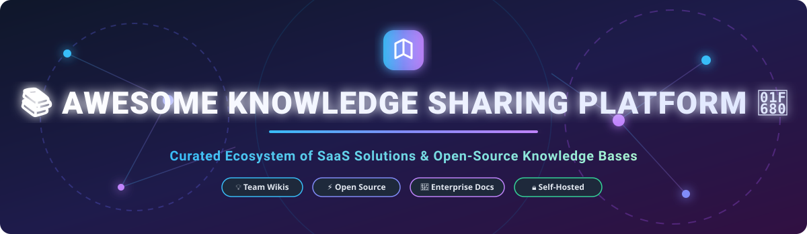

  

  
  
  

# 📚 Awesome Knowledge Sharing Platform Ecosystem 🚀

> **Curated List of SaaS Products & Open-Source GitHub Projects for Team Wikis, Internal Documentation, Knowledge Bases, PKM & Collaborative Workspaces**  
> *Last updated: September 2026*

---

## 🎯 Overview & Table of Contents

Welcome to the **Awesome Knowledge Sharing Platform** repository! This curated list tracks top-tier SaaS platforms and open-source software built for capturing, organizing, verifying, and distributing institutional knowledge across modern engineering, product, and enterprise teams.

- 📈 [Market Analysis & Industry Dynamics](#-market-analysis--industry-dynamics)
- 🏢 [SaaS & Hosted Knowledge Platforms](#-saas--hosted-knowledge-platforms)
- 💻 [Open-Source GitHub Projects & Self-Hosted Solutions](#-open-source-github-projects--self-hosted-solutions)
- 🤝 [How to Contribute](#-how-to-contribute)
- 💖 [Support & Sponsorship](#-support--sponsorship)
- ⚠️ [Disclaimer & Security Considerations](#%EF%B8%8F-disclaimer--security-considerations)
- 📈 [Star History](#-star-history)

---

## 📈 Market Analysis & Industry Dynamics

The global Knowledge Management Software market size is estimated at **$33.0 Billion in 2026** and is projected to expand to **$71.8 Billion by 2031**, growing at a **Compound Annual Growth Rate (CAGR) of 16.8%**.

### 🧩 Market Fragmentation & Competition Analysis
The sector is **moderately fragmented**:
- **Market Leaders / Enterprise Consolidation:** Large platforms like Atlassian Confluence and Notion hold significant enterprise market share by integrating team documentation directly into everyday project management workflows.
- **Specialized Niche Players:** A vibrant ecosystem of specialized SaaS products (e.g., Document360 for customer documentation, Archbee for API developer docs, Guru for AI knowledge cards) thrives alongside privacy-focused, local-first, and Git-backed open-source alternatives (Outline, Docmost, AppFlowy, AFFiNE, BookStack).
- **Winner-Take-All Dynamics:** The market is **not a winner-take-all landscape**. Diverse operational requirements—such as strict data sovereignty, offline capabilities, AI-powered enterprise search, and developer-centric Git workflows—ensure strong ongoing demand for both commercial SaaS and self-hosted open-source software.

---

## 🏢 SaaS & Hosted Knowledge Platforms

Below is a curated comparison of leading SaaS knowledge bases, team wikis, and documentation platforms sorted by company scale (Valuation / Revenue descending).

| Platform 🛠️ | Description 📝 | Company Scale & Valuation 💰 | Starting Paid Price 🏷️ | Free Tier / Free Trial Limits 🎁 |
| :--- | :--- | :--- | :--- | :--- |
| **[Atlassian Confluence](https://www.atlassian.com/software/confluence)** | Enterprise wiki and team collaboration platform deeply integrated with Jira and the Atlassian suite. | **$5.22B** (Atlassian Total FY2025 Revenue, Public: NASDAQ: TEAM) | $6.05 / user / month | **Forever Free Plan:** Up to 10 users, 2 GB storage limit, structured permissions. |
| **[Notion Enterprise](https://www.notion.so)** | All-in-one workspace combining collaborative docs, team wikis, databases, and AI project tracking. | **$11.00B** (Valuation, ~$600M ARR) | $10.00 / user / month (Plus Plan) | **Forever Free Plan:** Unlimited blocks for individuals, up to 10 block guests, 5 MB file upload limit, 7-day version history. |
| **[Guru](https://www.getguru.com)** | AI-powered enterprise knowledge management platform delivering verified cards directly inside Slack and web browsers. | **$105.60M** (Valuation, ~$33M ARR) | $15.00 / user / month (Starter Plan) | **30-Day Free Trial:** Full feature testing, no credit card required. No permanent free tier. |
| **[Document360](https://document360.com)** | Scalable knowledge base software for public help centers, product docs, and internal team wikis. | **>$10.00M** (Bootstrapped ARR by Kovai.co) | $199.00 / project / month (Standard Plan) | **14-Day Free Trial:** Access to full portal features and custom domain setup. No permanent free tier. |
| **[Bloomfire](https://bloomfire.com)** | Enterprise knowledge engagement platform with AI semantic search, community Q&A, and video transcription. | **~$10.00M** (Estimated ARR) | $25.00 / user / month (Custom enterprise contract) | **Demo-Based Access:** Guided enterprise sandbox trial with sales team. No public free tier. |
| **[Tettra](https://tettra.com)** | Lightweight internal knowledge base for growing teams with automated Slack and MS Teams answer bots. | **~$3.20M** (Estimated ARR) | $4.00 / user / month (Basic Plan, 10-seat min) | **30-Day Free Trial:** Full access up to 10 users with Slack integration. No permanent free tier. |
| **[Archbee](https://www.archbee.com)** | Technical documentation platform for product specs, developer API references, and internal engineering wikis. | **~$2.00M** (Estimated ARR) | $40.00 / month (Growing Plan, includes 5 seats) | **14-Day Free Trial:** Full platform access including API spec rendering and custom domains. No permanent free tier. |
| **[Nuclino](https://www.nuclino.com)** | Ultra-fast, lightweight collaborative wiki combining real-time document editing with interactive visual graph views. | **~$4.20M** (Valuation, ~$598K ARR) | $5.00 / user / month (Standard Plan) | **Forever Free Plan:** Capped at 50 total content items, 2 GB total storage limit. |
| **[KnowledgeOwl](https://www.knowledgeowl.com)** | Flexible knowledge base software with customizable CSS/JS layouts, role-based access, and unlimited reader access. | **~$750.00K** (Estimated ARR) | $79.00 / month (Flex Plan, 1 author included, unlimited readers) | **30-Day Free Trial:** Full feature access with unlimited test authors and readers. No permanent free tier. |
| **[Slab](https://slab.com)** | Modern team wiki featuring a clean block editor, unified cross-app search, and doc verification workflows. | **~$500.00K** (Estimated ARR) | $6.67 / user / month (Startup Plan) | **Forever Free Plan:** Up to 10 users, 10 GB total storage, basic integrations. |

---

## 💻 Open-Source GitHub Projects & Self-Hosted Solutions

Open-source knowledge management tools give organizations full ownership over their institutional data, eliminating per-seat SaaS costs while satisfying strict compliance and security policies.

Sorted by GitHub Stars_Count (Descending):

| Project 📦 | Description 📝 | GitHub_Stars ⭐ | License 📜 |
| :--- | :--- | :--- | :--- |
| **[AFFiNE](https://github.com/toeverything/AFFiNE)** | Privacy-focused, local-first workspace combining block documents and infinite canvas. Notion + Miro alternative with AI assistance. |  | MIT |
| **[AppFlowy](https://github.com/AppFlowy-IO/AppFlowy)** | Open-source Notion alternative built with Flutter and Rust. Local-first architecture with offline support and kanban databases. |  | AGPL-3.0 |
| **[Outline](https://github.com/outline/outline)** | Fast, collaborative knowledge base for teams with a polished editor, nested collections, Slack integration, and AI search. |  | BSL 1.1 |
| **[Logseq](https://github.com/logseq/logseq)** | Privacy-first, open-source knowledge management and note-taking platform with bidirectional links and PDF annotation. |  | AGPL-3.0 |
| **[Trilium Notes](https://github.com/zadam/trilium)** | Hierarchical personal knowledge graph and note-taking tool with rich fast-indexing backlinks, scripting, and web clipping. |  | AGPL-3.0 |
| **[Wiki.js](https://github.com/requarks/wiki)** | Modern, extensible Node.js wiki engine with Markdown editing, multi-auth, Git sync, and PostgreSQL/MySQL support. |  | AGPL-3.0 |
| **[Joplin](https://github.com/laurent22/joplin)** | Secure open-source note-taking and to-do application with end-to-end encryption and multi-device cloud synchronization. |  | MIT |
| **[Docmost](https://github.com/docmost/docmost)** | Open-source Confluence and Notion alternative for team wikis featuring real-time editing, spaces, permissions, and native diagrams. |  | AGPL-3.0 |
| **[BookStack](https://github.com/BookStackApp/BookStack)** | Simple, structured documentation platform organized in an intuitive Book → Chapter → Page hierarchy. |  | MIT |
| **[Docusaurus](https://github.com/facebook/docusaurus)** | Open-source static site generator powered by React for fast deployment of developer documentation and technical wikis. |  | MIT |
| **[SiYuan](https://github.com/siyuan-note/siyuan)** | Privacy-first local-first personal knowledge management system supporting block-level ref, fine-grained SQL querying, and Markdown. |  | AGPL-3.0 |
| **[Docs](https://github.com/etalab/docs)** | Collaborative note-taking, wiki, and documentation platform built with Django and Next.js (created by French government). |  | MIT |
| **[TiddlyWiki](https://github.com/TiddlyWiki/TiddlyWiki5)** | Unique non-linear personal web notebook stored inside a single HTML file with extensive tagging and plugin support. |  | BSD-3-Clause |
| **[HedgeDoc](https://github.com/hedgedoc/hedgedoc)** | Real-time collaborative Markdown editor for notes, team documentation, and slide presentations. |  | AGPL-3.0 |
| **[DokuWiki](https://github.com/dokuwiki/dokuwiki)** | Lightweight, highly versatile file-based wiki engine requiring no database with plain-text Markdown storage. |  | GPL-2.0 |
| **[Raneto](https://github.com/gilbitron/Raneto)** | Flat-file Markdown knowledge base for Node.js with built-in full-text search and customizable responsive templates. |  | MIT |
| **[Documize](https://github.com/documize/community)** | Self-hosted internal and customer documentation workspace built for software engineering teams. |  | AGPL-3.0 |
| **[Gitit](https://github.com/jgm/gitit)** | Wiki engine storing pages in a Git or Mercurial repository and rendering Markdown/reST via Pandoc. |  | GPL-2.0 |
| **[django-wiki](https://github.com/django-wiki/django-wiki)** | Reusable and pluggable Django wiki framework with revision history, Markdown rendering, and granular permission controls. |  | GPL-3.0 |

---

## 🛠️ Additional Technical Categories

- **🧠 Knowledge Graph & PKM (Personal Knowledge Management):** [SiYuan](https://github.com/siyuan-note/siyuan), [Logseq](https://github.com/logseq/logseq), [Joplin](https://github.com/laurent22/joplin), [Trilium Notes](https://github.com/zadam/trilium).
- **📖 API Documentation & Static Sites:** [Docusaurus](https://github.com/facebook/docusaurus), [MkDocs](https://github.com/mkdocs/mkdocs).
- **💬 Q&A & Community Knowledge Sharing:** [Answer](https://github.com/apache/incubator-answer) (Open-source Stack Overflow clone), [Discourse](https://github.com/discourse/discourse).
- **🐙 Git-Backed Wikis:** [Gollum](https://github.com/gollum/gollum), [Commonplace](https://github.com/commonplace/commonplace).

---

## 🤝 How to Contribute

We welcome contributions from engineering teams, technical writers, open-source maintainers, and knowledge managers! 🌟

1. **Fork** this repository.
2. **Add/Edit** entries in `README.md` following our structured layout.
3. Include: Product name, official link, factual 1-2 sentence description, open-source license, or exact SaaS pricing details.
4. **Submit a Pull Request** with a clear explanation of your changes.

---

## 💖 Support & Sponsorship

Thank you for exploring and using this knowledge sharing resource! ☕

If this project saved you time, helped you evaluate knowledge management architectures, or added value to your workflow, please consider supporting the project:

- ⭐ **Star** this repository to help others discover it.
- 🍴 **Fork** and contribute new knowledge management platforms or open-source tools.
- 📢 **Share** this list with your team, network, or social media.
- ☕ **Buy me a coffee / Sponsor:** You can support ongoing maintenance via [GitHub Sponsors](https://github.com/sponsors/ishandutta2007).

---

## ⚠️ Disclaimer & Security Considerations

- This repository is a community-curated list maintained for educational, technical evaluation, and discovery purposes.
- Knowledge management platforms handle sensitive internal IP; ensure appropriate SAML/SSO access governance, role-based access control (RBAC), and encryption at rest.
- Self-hosted open-source deployments require ongoing security updates, database backups, and network perimeter protection.

---

## 📈 Star History

