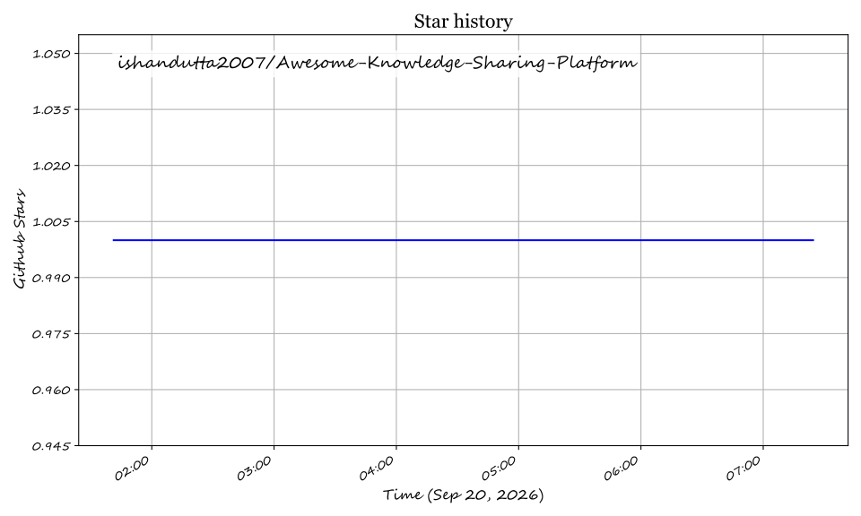

# Awesome-Knowledge-Sharing-Platform

Top Knowledge Sharing Platforms Ecosystem

Curated List of SaaS Products & Open-Source GitHub Projects
Focused on Team Wikis, Internal Documentation, Knowledge Bases & Collaborative Note-Taking
Last updated: September 2026

This repository tracks notable SaaS platforms and open-source projects for Knowledge Sharing. These tools help teams capture, organize, verify, and share institutional knowledge through wikis, documentation sites, knowledge bases, and collaborative workspaces.

Examples include Guru, Slab, Tettra, Confluence, Notion Enterprise, Document360, Bloomfire, KnowledgeOwl, Nuclino, and Archbee (the category leaders).

Open-source emphasis: This section is heavily expanded with every major active project for self-hosting, custom knowledge workflows, and transparent data ownership — ideal for teams that want full control over sensitive internal documentation without per-seat SaaS fees.

Contributions welcome! Open a PR to add/update entries. Keep descriptions factual and link to official sites.

Table of Contents

SaaS/Hosted Platforms

Open-Source GitHub Projects

How to Contribute

Disclaimer

SaaS/Hosted Platforms

Guru
AI-powered knowledge management platform that surfaces verified answers directly in Slack, browser, and other work tools. Organizes knowledge into cards, boards, and collections with verification workflows -
1
-
14
.

Slab
Modern knowledge base platform with a clean editor, unified search across connected tools, and strong integrations with Slack, Google Drive, and GitHub. Focuses on preventing stale docs through verification workflows -
1
.

Tettra
Lightweight internal knowledge base for teams. Integrates deeply with Slack and Microsoft Teams to capture tribal knowledge and turn conversations into permanent documentation -
1
-
8
.

Confluence
Atlassian's enterprise wiki and documentation platform. Deeply integrated with Jira and the broader Atlassian ecosystem. Available as Cloud and Data Center -
2
-
9
.

Notion Enterprise
All-in-one workspace combining docs, wikis, databases, and project management. Enterprise tier adds SSO, audit logs, and advanced permissions -
2
-
9
.

Document360
Knowledge base software for creating public help centers and internal documentation. Features versioning, role-based access, analytics, and multi-language support -
2
-
9
.

Bloomfire
Knowledge engagement platform with AI-powered search, community Q&A, and content verification. Focused on enterprise knowledge sharing and employee onboarding. Priced as fixed annual contract rather than per-seat -
10
.

KnowledgeOwl
Knowledge base software with a focus on simplicity, customization, and customer support. Offers public and private knowledge bases -
10
.

Nuclino
Lightweight, collaborative wiki and knowledge base. Combines docs, real-time editing, and a visual graph view for connected knowledge -
3
.

Archbee
Documentation platform for product and API docs, internal knowledge bases, and team wikis. Features a block editor, diagrams, and developer-friendly API references -
3
.

Open-Source GitHub Projects

Outline
Fast, collaborative knowledge base for teams with a polished Notion-like editor. Features real-time collaboration, nested collections, Slack integration, and AI-powered search. Requires external OIDC/SAML for authentication. ~38.8k stars. License: BSL 1.1 -
4
.

Docmost
Open-source Confluence and Notion alternative for team wikis. Features real-time collaboration, spaces, granular permissions, native diagrams (Draw.io, Excalidraw, Mermaid), and built-in email/password auth. ~21k stars. License: AGPL-3.0 -
4
-
7
.

AppFlowy
Open-source Notion alternative built with Flutter and Rust. Local-first architecture with offline support, kanban boards, databases, and AI integration. Self-hosted sync server available via AppFlowy Cloud. ~66k stars. License: AGPL-3.0 -
6
-
12
.

AFFiNE
Privacy-focused, local-first workspace combining block documents and infinite canvas. Positioned as a Notion + Miro alternative with AI-assisted writing, self-hosting, and offline support. ~76k stars. License: MIT -
6
-
12
.

Wiki.js
Modern, extensible Node.js wiki with Markdown editing, powerful admin tools, multiple auth options, and support for PostgreSQL, MySQL, MariaDB, SQLite, and SQL Server. Ideal for developer-facing and Git-backed content. ~25k stars. License: AGPL-3.0 -
4
.

BookStack
Simple, structured documentation platform organized in a book → chapter → page hierarchy. WYSIWYG and Markdown editors, role-based permissions, and full-text search. Ideal for non-technical teams. ~16k stars. License: MIT -
4
.

Docs
Collaborative note-taking, wiki, and documentation platform that scales. Built with Django and React/Next.js. Created by the French government as an open-source Google Docs alternative. ~14.8k stars. License: MIT -
4
.

XWiki
Enterprise-grade Java wiki platform with structured data capabilities, page-level permissions, LDAP/Active Directory integration, and a mature extension ecosystem. Supports on-premises deployment for organizations with strict compliance needs. License: LGPL-2.1 -
13
.

Trilium Notes
Self-contained personal knowledge graph and note-taking tool. Hierarchical structure with backlinks, scripting, and offline-first architecture. Ideal for individuals and very small teams. ~28k stars. License: AGPL-3.0 -
4
-
19
.

DokuWiki
Lightweight, file-based wiki engine requiring no database. Plain-text storage, extensive plugin/template ecosystem, ACL support, and versioning. Popular for simple, low-maintenance knowledge bases. License: GPL-2.0 -
5
.

Raneto
File-based Markdown knowledge base for Node.js. No database required, with full-text search, theming, and optional login protection. ~2.9k stars. License: MIT -
5
.

Documize
Self-hosted knowledge base and documentation platform for internal and external docs. Features spaces, labels, search, and enterprise authentication. ~2.4k stars. License: AGPL-3.0 -
5
.

Gitit
Wiki engine that stores pages in a Git repository and uses Pandoc for markup rendering. Supports multiple markup formats, diagrams, math, and RSS feeds. ~2.3k stars. License: GPL-2.0 -
5
-
18
.

django-wiki
Extensible Django wiki application with Markdown pages, versioning, permissions, and a pluggable architecture for integrating knowledge bases into Django sites. ~1.9k stars. License: GPL-3.0 -
5
.

Commonplace
Stateless wiki frontend powered entirely by a Git repository using Open Knowledge Format. Works with GitHub, GitLab, and self-hosted Git. Includes knowledge graph, Markdown editor, and AI-friendly MCP server. License: MIT -
4
.

TiddlyWiki
Self-contained JavaScript wiki for the browser, Node.js, and AWS Lambda. Single HTML file with all wiki functionality including editing, saving, tagging, and searching. ~7.7k stars. License: BSD-3-Clause -
5
.

HedgeDoc
Free, open-source, self-hosted Markdown editor for real-time collaborative note-taking. Features presentation mode, revision history, and permission controls. License: AGPL-3.0 -
5
.

MediaWiki
The wiki engine behind Wikipedia. Proven scalability to millions of pages, hundreds of extensions, and robust wiki-link syntax. Best for very large, highly interconnected knowledge repositories. License: GPL -
5
.

Additional Strong Open-Source Options

Knowledge Graph & PKM: SiYuan (block-level references, local-first), Logseq (outliner with bidirectional links), Joplin (Evernote replacement with encryption and flexible sync) -
6
-
12
.

API Documentation: Docusaurus (React-based static docs, Apache 2.0), MkDocs (Python-based static docs).

Q&A & Community Knowledge: Answer (open-source Stack Overflow clone for teams), Discourse (forum-based knowledge sharing).

Git-Backed Wikis: Gollum (Git-powered wiki with local frontend), Gitea Wiki (zero-infrastructure wiki bundled with Gitea) -
4
-
18
.

Frameworks for building custom systems: Combine Outline or Docmost for the core wiki, Docusaurus for public documentation, AppFlowy or AFFiNE for collaborative workspaces, and PostgreSQL + Redis + S3 for persistence. Add Ollama for self-hosted AI-powered search and writing assistance.

How to Contribute

Fork the repo.

Add/edit entries in README.md (follow existing format).

Include: name, link, 1–2 sentence description, and whether it's SaaS or open-source.

Submit PR with a short explanation.

Star the repo if you find it useful!

Disclaimer

This is a community-curated list — not exhaustive and not an endorsement.

Knowledge management tools may store sensitive internal documentation; ensure proper access controls and encryption.

Self-hosted open-source solutions require regular maintenance, security updates, and backup strategies.

Made for engineering teams, technical writers, product managers, and knowledge workers.
Let's make knowledge sharing more open, transparent, and collaborative.

## ⭐ Star History

<a href="https://star-history.com/#ishandutta2007/Awesome-Knowledge-Sharing-Platform&Timeline" align="center">
  <picture>
    <source media="(prefers-color-scheme: dark)" srcset="assets/ishandutta2007_Awesome-Knowledge-Sharing-Platform_growth.svg">
    
  </picture>
</a>
